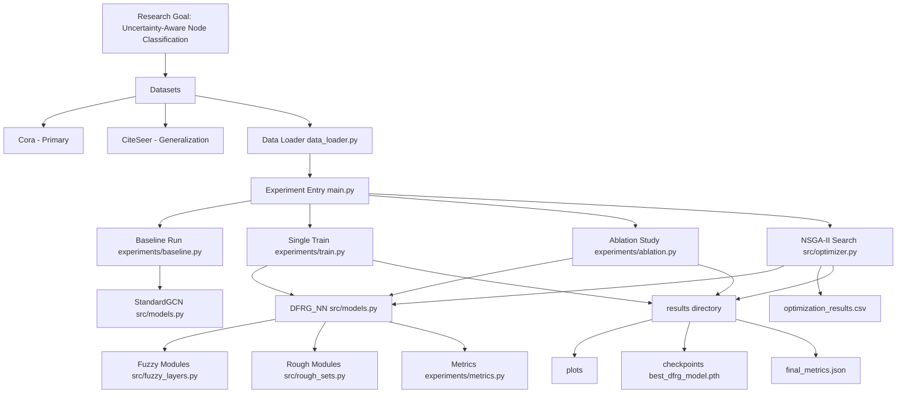
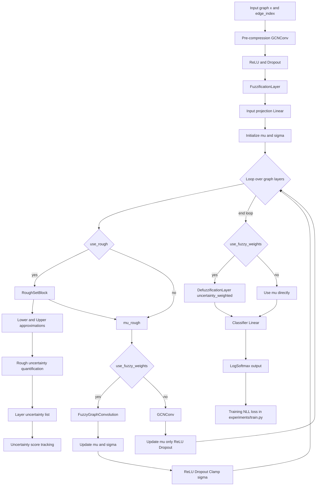
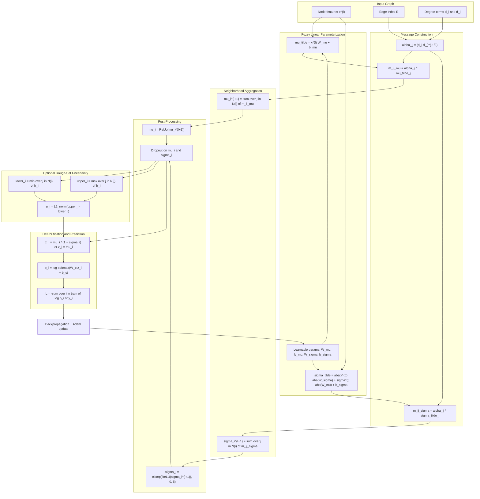

# DFRG-NN: Deep Fuzzy-Rough Graph Neural Network

## Project Summary
This repository implements a research prototype that combines:

- fuzzy feature modeling,
- rough set neighborhood approximation, and
- graph neural networks,

with multi-objective architecture search using NSGA-II.

The main task is node classification on citation graphs (Cora as primary dataset), with additional scripts for cross-dataset and robustness-oriented analysis.

## Research Objective
The project investigates whether combining fuzzy and rough uncertainty modeling inside a GNN can improve the accuracy-interpretability-robustness tradeoff compared to standard graph convolution models.

## Architecture

### High-Level Project Architecture


### Low-Level Model Architecture (DFRG_NN Forward Path)


### Complete Message Passing Architecture (Mermaid + Math)


## Tech Stack and Libraries

### Core Stack
- Python 3.9+
- PyTorch (`torch>=2.0.0`) for tensor operations, autograd, and model training
- PyTorch Geometric (`torch-geometric>=2.3.0`) for graph neural network layers and Planetoid datasets

### Optimization and Search
- pymoo (`pymoo>=0.6.0`) for NSGA-II multi-objective architecture search

### Data and Metrics
- NumPy for numerical operations
- pandas for tabular result storage and analysis
- scikit-learn for evaluation metrics (for example F1 score variants)

### Visualization and Analysis
- Matplotlib for experiment and Pareto/ablation plotting
- NetworkX for graph-level utility operations

### Experiment Utilities
- tqdm for training and experiment progress tracking
- unittest (Python standard library) for component-level tests in `tests/test_components.py`

## What Has Been Implemented (Research Perspective)

### 1. Core Model Contributions
- **Hybrid DFRG-NN architecture** in [src/models.py](src/models.py):
   - pre-compression GCN layer,
   - fuzzification layer,
   - optional rough-set approximation blocks,
   - optional fuzzy graph convolution,
   - defuzzification and classifier head.
- **Baseline GCN** implementation for comparison in [src/models.py](src/models.py).

### 2. Uncertainty Modules
- **Fuzzification / fuzzy message passing / defuzzification** in [src/fuzzy_layers.py](src/fuzzy_layers.py).
- **Lower and upper rough approximations + uncertainty quantification** in [src/rough_sets.py](src/rough_sets.py).

### 3. Training and Evaluation Pipeline
- Configurable train/eval loop in [experiments/train.py](experiments/train.py).
- Metrics (accuracy, macro/micro F1, uncertainty aggregation, generalization gap) in [experiments/metrics.py](experiments/metrics.py).

### 4. Optimization and Empirical Studies
- **NSGA-II multi-objective search** (accuracy vs complexity vs generalization gap) in [src/optimizer.py](src/optimizer.py).
- **Ablation study runner** (full model, no fuzzy weights, no rough sets, shallow model) in [experiments/ablation.py](experiments/ablation.py).
- **Additional analysis scripts**:
   - generalization on CiteSeer: [experiments/generalization_test.py](experiments/generalization_test.py)
   - robustness under feature noise: [experiments/robustness_test.py](experiments/robustness_test.py)
   - fuzzy activation tracing demo: [experiments/explain_fuzzy.py](experiments/explain_fuzzy.py)

### 5. Visualization and Reproducibility Assets
- Plot generation scripts in [experiments/visualize_results.py](experiments/visualize_results.py) and [experiments/visualize.py](experiments/visualize.py).
- Component-level unit tests in [tests/test_components.py](tests/test_components.py).

## Datasets Used

This project uses the built-in **Planetoid public split masks** from PyG (`train_mask`, `val_mask`, `test_mask`) and does not create custom random splits.

Split protocol used throughout experiments:
- **Training split**: supervised nodes for parameter updates.
- **Validation split**: model selection and hyperparameter/architecture comparison.
- **Test split**: final held-out reporting.

### Cora (Primary Dataset)
- Loaded by [data_loader.py](data_loader.py) via PyG `Planetoid`.
- Stored under [data/Planetoid/Cora](data/Planetoid/Cora).
- Used by baseline, training, ablation, and optimization workflows.
- Split sizes used in this project (from dataset masks):
   - Train: **140** nodes
   - Validation: **500** nodes
   - Test: **1000** nodes
   - Total nodes: **2708**

### CiteSeer (Generalization Dataset)
- Used by [experiments/generalization_test.py](experiments/generalization_test.py).
- Repository currently contains CiteSeer data under [data/citeseer](data/citeseer).
- Split sizes used in this project (from dataset masks):
   - Train: **120** nodes
   - Validation: **500** nodes
   - Test: **1000** nodes
   - Total nodes: **3327**

## Experimental Setup and Training Parameters

### Core Training Protocol
- Device selection is automatic (CUDA if available, otherwise CPU) in [main.py](main.py), [experiments/baseline.py](experiments/baseline.py), [experiments/ablation.py](experiments/ablation.py), [src/optimizer.py](src/optimizer.py), and [experiments/generalization_test.py](experiments/generalization_test.py).
- Data split usage is mask-based: training on `train_mask`, validation on `val_mask`, and held-out testing on `test_mask` in [experiments/train.py](experiments/train.py).
- Loss function: negative log-likelihood loss (NLL loss) on training nodes in [experiments/train.py](experiments/train.py).
- Optimizer: Adam (weight decay used in all core runs) in [experiments/train.py](experiments/train.py) and [experiments/baseline.py](experiments/baseline.py).
- Validation schedule: every 10 epochs (and final epoch) in [experiments/train.py](experiments/train.py).
- Reported metrics: Accuracy, Macro-F1, Micro-F1, uncertainty score, parameter-count complexity, and generalization gap in [experiments/metrics.py](experiments/metrics.py) and [experiments/train.py](experiments/train.py).

### Configuration by Experiment Mode

| Mode / Script | Model Type | Hidden Dim | Layers | Dropout | LR | Epochs | Weight Decay | Rough Sets | Fuzzy Weights |
|---|---|---:|---:|---:|---:|---:|---:|---|---|
| Baseline [experiments/baseline.py](experiments/baseline.py) | StandardGCN | 16 (inside model) | 2 GCN layers | default in model | 0.01 | 200 | 5e-4 | No | No |
| Single train [main.py](main.py) -> [experiments/train.py](experiments/train.py) | DFRG_NN | 64 | 3 | 0.5 | 0.005 | 50 | 5e-4 | True | True |
| Ablation base [experiments/ablation.py](experiments/ablation.py) | DFRG_NN | 32 | 2 | 0.5 | 0.001 | 100 | 5e-4 | True | True |
| Generalization [experiments/generalization_test.py](experiments/generalization_test.py) | DFRG_NN | 32 | 2 | 0.5 | 0.001 | 200 | 5e-4 | True | True |
| Final best model [experiments/finalize_best_model.py](experiments/finalize_best_model.py) | DFRG_NN | 128 | 1 | 0.31 | 0.001 | 200 | 5e-4 | True | False |

### Ablation Variants and Repetition Policy
- Implemented variants in [experiments/ablation.py](experiments/ablation.py):
   - Full DFRG-NN (base)
   - AB-1: No fuzzy weights
   - AB-2: No rough sets
   - AB-3: Shallow architecture (1 layer)
- Repetition for stability: 3 seeds (`0, 1, 2`) per variant; mean and standard deviation are reported.

### NSGA-II Optimization Setup
- Optimization driver: [src/optimizer.py](src/optimizer.py).
- Objectives minimized:
   - validation error = 1 - validation accuracy,
   - normalized model complexity = parameter_count / 10000,
   - generalization gap.
- Search variables:
   - layers: 1 to 2 (encoded continuous, then cast to int),
   - hidden dimension: {16, 32, 64, 128},
   - dropout: 0.0 to 0.7,
   - learning rate: {0.001, 0.005, 0.01},
   - rough toggle: {False, True},
   - fuzzy-weight toggle: {False, True}.
- Algorithm settings:
   - generations: 10,
   - population size: 20,
   - offspring per generation: 10,
   - crossover: SBX (probability 0.9, eta 15),
   - mutation: PM (probability 0.8, eta 20),
   - optimization seed: 42,
   - training budget per candidate: 30 epochs.

## Running the Project

### 1. Install Dependencies
```bash
pip install -r requirements.txt
```

### 2. Main Entry Point
Use [main.py](main.py) with one of the supported modes:

```bash
python main.py --mode baseline
python main.py --mode train
python main.py --mode ablation
python main.py --mode optimize
```

### 3. Additional Experiment Scripts
```bash
python experiments/finalize_best_model.py
python experiments/visualize_results.py
python experiments/visualize.py
python experiments/generalization_test.py
python experiments/robustness_test.py
python experiments/explain_fuzzy.py
```

### 4. Run Unit Tests
```bash
python -m unittest tests/test_components.py
```

## Results and Artifacts: Where Everything Is Produced

### Optimization Outputs
- Pareto candidate table: [optimization_results.csv](optimization_results.csv)
- Optimization console log (saved text): [results/optimization_log.txt](results/optimization_log.txt)

### Finalized Model Outputs
- Model checkpoint: [results/checkpoints/best_dfrg_model.pth](results/checkpoints/best_dfrg_model.pth)
- Final metrics JSON: [results/final_metrics.json](results/final_metrics.json)

### Visualization Outputs
- Summary Pareto figure: [results/pareto_front.png](results/pareto_front.png)
- Summary ablation figure: [results/ablation_study.png](results/ablation_study.png)
- Additional plots folder:
   - [results/plots/ablation_results.png](results/plots/ablation_results.png)
   - [results/plots/pareto_front.png](results/plots/pareto_front.png)
   - [results/plots/training_curves.png](results/plots/training_curves.png)
   - [results/plots/robustness_test.png](results/plots/robustness_test.png)

### Ablation Log Output
- Text log from ablation runs: [results/ablation_log.txt](results/ablation_log.txt)

## Current Empirical Snapshot (From Saved Artifacts)
- Best NSGA-II solution in [optimization_results.csv](optimization_results.csv):
   - validation accuracy: **0.774**
   - layers: **1**
   - hidden dimension: **128**
   - rough sets: **True**
   - fuzzy weights: **False**
- Finalized metrics in [results/final_metrics.json](results/final_metrics.json):
   - validation accuracy: **0.780**
   - test accuracy: **0.786**
   - test macro-F1: **0.7812**

## Notes and Scope
- The core experimental pipeline is fully implemented for baseline, training, ablation, and NSGA-II optimization.
- Some scripts are exploratory research utilities (for example robustness and explainability demos) and may require additional checkpoint-loading steps for strict benchmarking workflows.
- The original research plan is documented in [RESEARCH_ROADMAP.md](RESEARCH_ROADMAP.md).

## Dependencies
See [requirements.txt](requirements.txt) for the exact package list.
